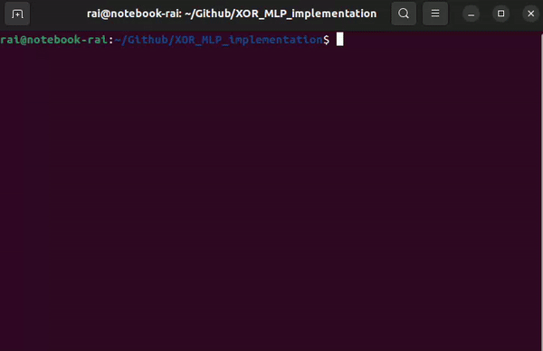

# XOR_MLP_implementation

Esse repositório apresenta uma implementação de MLP (Multilayer Perceptron) como porta lógica XOR. 

## Funcionamento

A implementação foi feita através da linguagem Python 3 no arquivo: `xor_mlp.py` (com um script regular) e no arquivo `xor_mlp_torch.py` (com um script utilizando pytorch). No script regular, uma classe que representa a lógica de um perceptron é usada para criar um MLP que funciona como porta lógica XOR.

Para que isso ocorra, o MLP recebe um array com dados de input (`inputs`) e um array com dados esperados de output (`targets`). O array com dados de input representa todas as 4 combinações possíveis para input da porta XOR e o demais representa, respectivamene, as saídas corretas para cada input. Com base nesses dados, o MLP é treinado através da lógica de *backpropagation*, que adequa os pesos e o bias dos perceptrons de acordo com a variação entre o output obtido e o output esperado.

Ao executar o código, o MLP é treinado e o andamento desse processo a cada época é impresso no terminal. Do mesmo modo, o resultado final obtido a partir do array de input é impresso no terminal após o processo de treinamento.

## Inicialização

### Pré-requisitos:

- Python3 instalado
- Biblioteca `numpy` instalada
- Biblioteca `torch` instalada
- Git instalado e com chave SSH configurada

### Passo a passo:

1. Abra uma janela de terminal e clone o repositório através do seguinte comando:

```bash
git clone git@github.com:RaiDeOliveira/XOR_MLP_implementation.git
```

2. Digite os seguintes comandos para executar o script regular:

```bash
cd XOR_MLP_implementation
python3 xor_mlp.py
```

3. Digite o seguinte comando para executar o script utilizando Pytorch:

```bash
python3 xor_mlp_torch.py
```

## Demonstração


